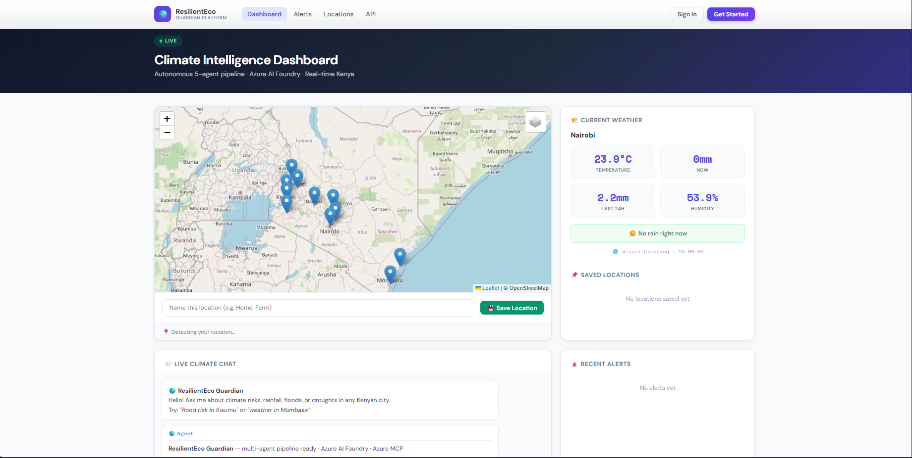
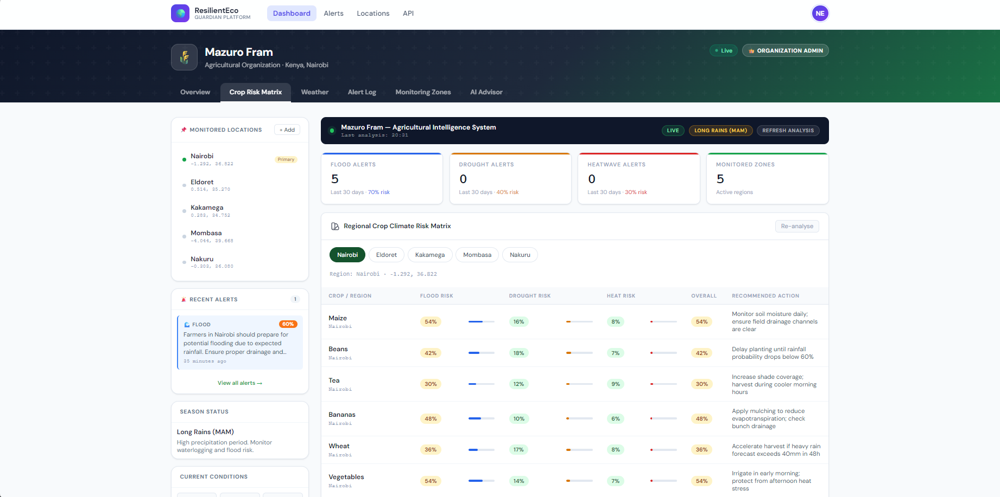
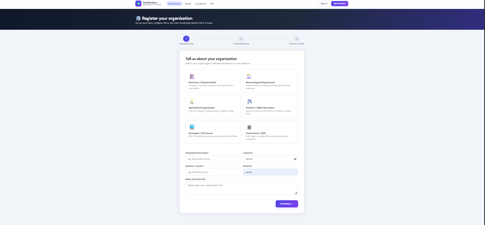
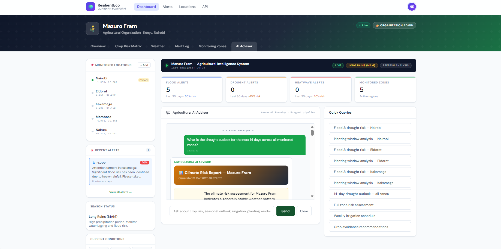
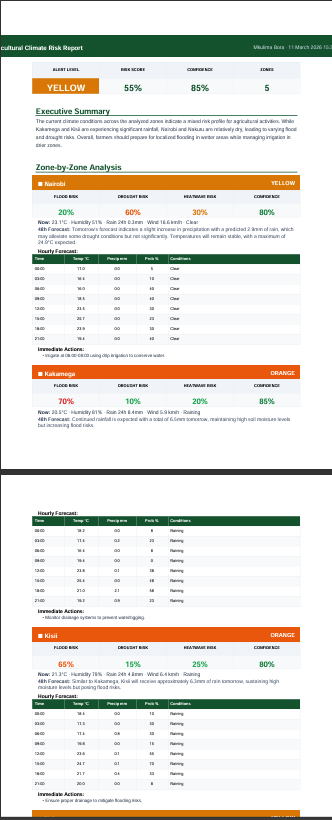
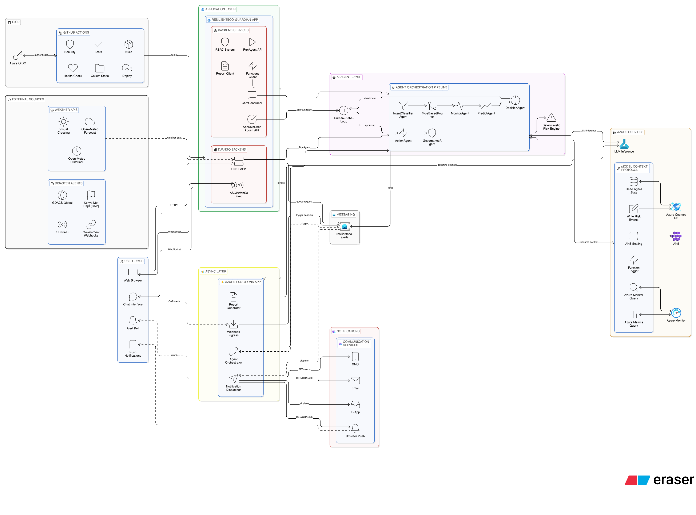

# ResilientEco Guardian
### AI-Powered Climate Risk Intelligence Platform

> **Azure AI Foundry · Multi-Agent Pipeline · Real-Time Advisory · Government-Grade Alerts**

---

&nbsp;

## Table of Contents

1. [Platform Overview](#platform-overview)
2. [Live Dashboard](#live-dashboard)
3. [AI Agent Pipeline](#ai-agent-pipeline)
4. [Report Generation](#report-generation)
5. [System Architecture](#system-architecture)
6. [Who It Serves](#who-it-serves)
7. [Use Case Scenarios](#use-case-scenarios)
8. [Business Model & Revenue Pathways](#business-model--revenue-pathways)

---

&nbsp;

## Platform Overview

ResilientEco Guardian is a production-grade multi-agent climate intelligence system built on Azure AI Foundry. It ingests live weather data, runs a five-agent reasoning pipeline, and delivers actionable risk advisories to organizations that depend on weather to protect lives, crops, infrastructure, and operations.

The system is not a dashboard that shows weather. It is an **autonomous decision-support system** — it classifies threats, predicts risk scores, applies deterministic policy rules, triggers notifications, and generates publication-ready reports, all in real time over WebSocket with full audit trails.

| Capability | Detail |
|---|---|
| **LLM Backend** | Azure AI Foundry (AIProjectClient) with AzureOpenAI + OpenAI fallback |
| **Agent Pipeline** | IntentClassifier → Router → Monitor → Predict → Decision → Action → Governance |
| **Alert Levels** | GREEN / YELLOW / ORANGE / RED with deterministic policy engine |
| **Notifications** | SMS · Email · Browser Push · In-App Bell |
| **Report Formats** | JSON + PDF (ReportLab) with zone-by-zone analysis |
| **Webhook Ingestion** | CAP XML · GDACS GeoJSON · NWS Atom · Generic JSON |
| **Compliance** | RAI checks · UN SDG alignment · Azure Monitor audit trail |

---

&nbsp;

## Live Dashboard

### Main Chat Interface



&nbsp;

### Runtime Routing Panel

The routing panel appears below every pipeline run. It shows the intent classification result, confidence score, the workflow graph that was selected, the full pipeline step sequence, routing feature chips (rainfall volume, temperature, soil moisture), and the task ledger completion count.

&nbsp;

### Alert Level Indicators



&nbsp;

### Organization Registration Wizard



&nbsp;

---

&nbsp;

## AI Agent Pipeline

The five agents run in sequence on every query. Each agent's output streams to the frontend as a separate WebSocket message so users see results building in real time rather than waiting for the full pipeline to complete.

```
User Query
    │
    ▼
IntentClassifierAgent ──── keyword match + LLM fallback (< 65% confidence)
    │  flood / drought / heatwave / agriculture / emergency / forecast
    ▼
TypeBasedRouter ──────────── rainfall volume · temperature · soil moisture
    │  severe_weather / flood / drought / heatwave / standard_forecast
    ▼
MonitorAgent ─────────────── Azure MCP → infrastructure health + Cosmos DB state
    │  weather anomalies · alert signals · data quality score
    ▼
PredictAgent ─────────────── flood risk 0–100 · drought risk 0–100 · heatwave risk 0–100
    │  overall risk level · confidence percentage · primary risk type
    ▼
DecisionAgent ────────────── deterministic policy engine → GREEN / YELLOW / ORANGE / RED
    │  WorkflowCheckpoint if risk ≥ 85 · AKS scale if risk ≥ 60
    ▼
ActionAgent ──────────────── alert message · SMS message · immediate steps
    │  triggers Azure Functions for ORANGE / RED
    ▼
GovernanceAgent ──────────── Azure Monitor logs · RAI compliance · UN SDG alignment
    │  final recommendation · confidence in chain
    ▼
WebSocket Stream → Frontend Cards
```

&nbsp;

---

&nbsp;

## Report Generation

On-demand detailed reports are generated by the ReportGenerator Azure Function. When a user types a phrase like "full report", "generate report", or "all my zones", the system bypasses the standard pipeline and instead fetches live weather data for every saved monitoring zone in parallel, then calls Azure OpenAI with a structured prompt to produce the full report JSON. A formatted PDF is generated using ReportLab and returned as base64 alongside the JSON.

### Report Contents

| Section | What it contains |
|---|---|
| **Executive Summary** | 3–4 sentence overall risk status |
| **Zone Analysis** | Alert level · flood/drought/heat scores · current conditions per zone |
| **Hourly Forecast** | 3-hour interval breakdown for each zone |
| **48-Hour Narrative** | Prose forecast with specific values |
| **Crop Risk Matrix** | Per-crop flood/drought/heat scores with recommended action |
| **Planting Window** | Current season · recommended crops · crops to delay · crops to avoid |
| **Irrigation Schedule** | Zone-specific timing and method recommendations |
| **Action Items** | Next 24 hours · Next 7 days |
| **7-Day Outlook** | Narrative forecast |
| **Report Narrative** | 400–600 word professional prose suitable for printing |

&nbsp;

### Report Type Adapts to Organization

| Org Domain | Report Focus |
|---|---|
| **Agricultural** | Crop risk matrix · planting window · irrigation schedule · soil conditions |
| **Meteorological** | Synoptic analysis · pressure systems · upper air · technical precision |
| **Disaster Relief** | Full cross-domain · evacuation triggers · resource deployment |
| **Government** | Full cross-domain · policy alignment · population impact · SDG reporting |
| **Aviation** | Wind · visibility · ceiling · convective activity |

&nbsp;

### Sample Report Output



&nbsp;



&nbsp;

---

&nbsp;

## System Architecture

### High-Level Architecture Diagram



&nbsp;

### Component Map

```
┌─────────────────────────────────────────────────────────────┐
│                        CLIENT LAYER                         │
│          Browser (WebSocket)  ·  REST API  ·  Webhooks      │
└──────────────────────┬──────────────────────────────────────┘
                       │
┌──────────────────────▼──────────────────────────────────────┐
│                     DJANGO APPLICATION                       │
│   ChatConsumer (Channels)  ·  REST Views  ·  RBAC Auth      │
│   AgentExecutionLog  ·  WorkflowCheckpoint  ·  AlertLog     │
└──────┬───────────────┬──────────────────┬───────────────────┘
       │               │                  │
┌──────▼──────┐ ┌──────▼──────┐ ┌────────▼────────┐
│ AGENT       │ │  AZURE AI   │ │  AZURE MCP      │
│ PIPELINE    │ │  FOUNDRY    │ │  CLIENT         │
│ 5 Agents    │ │  (LLM)      │ │  7 Tools        │
└──────┬──────┘ └─────────────┘ └─────────────────┘
       │
┌──────▼──────────────────────────────────────────────────────┐
│                    AZURE FUNCTIONS LAYER                     │
│                                                             │
│  AgentOrchestrator  ·  NotificationDispatcher               │
│  ReportGenerator    ·  WebhookIngress                       │
│                                                             │
│  Service Bus  ·  ACS (SMS/Email)  ·  Web Push (VAPID)       │
│  Cosmos DB    ·  Azure Monitor                              │
└─────────────────────────────────────────────────────────────┘
```

&nbsp;

### Data Flow: Alert Triggered by Government Webhook


&nbsp;

### Data Flow: User Requests Report via Chat


&nbsp;

---

&nbsp;

## Who It Serves

ResilientEco Guardian is designed for any organization whose operations, safety, or revenue are directly affected by weather and climate risk. The platform adapts its analysis, report type, and alert thresholds to each organization domain.

&nbsp;

### 🌾 Agricultural Organizations & Cooperatives

Farmers, agribusinesses, and cooperatives face crop loss, irrigation failure, and planting timing decisions driven entirely by weather. Guardian gives them a 48-hour window of actionable intelligence they would otherwise have to piece together manually from multiple sources.

**What they get:**
- Crop-specific flood, drought, and heat risk scores for every monitored zone
- Planting window assessment for the current season with crop-by-crop go/delay/avoid recommendations
- Irrigation timing and method recommendations down to specific hours
- SMS alerts when risk crosses their configured threshold, even if they have no internet access
- PDF reports suitable for sharing with extension officers, insurers, or cooperatives

**Sample AI Advisor recommendations for an agricultural org:**

> *"Flood risk in Kakamega is currently at 78%. Do not plant maize this week — waterlogging probability exceeds safe germination threshold. Delay planting by 5–7 days. Open all field drainage channels today. Beans in the upper zone remain viable; apply mulching to retain structure. Irrigate before 8am only — afternoon soil saturation risk is high."*

> *"Drought risk in Nakuru has risen to 64% — above your configured alert threshold. Increase irrigation frequency by 35% for the next 10 days. Prioritize drip irrigation for tomatoes and onions. Maize in Zone 2 should be harvested early if no rainfall exceeds 15mm in the next 48 hours. Your planting window for long rains closes in approximately 12 days."*

> *"Heatwave risk at 71% across all zones. Harvest leafy vegetables before 09:00 to avoid heat stress damage. Shade netting recommended for seedling beds. Hold all new transplanting until temperatures drop below 32°C. Current UV index is 9 — worker field hours should be limited to morning and late afternoon shifts."*


&nbsp;

### 🏛️ Government Agencies & Meteorological Departments

National meteorological services, disaster management authorities, and county governments need to coordinate across agencies, issue public alerts at the right time, and maintain audit trails for accountability.

**What they get:**
- CAP XML webhook integration — their existing alert systems trigger Guardian automatically
- Full cross-domain reports: flood, drought, heatwave, cyclone, wildfire risk in one document
- UN SDG alignment reporting built into every pipeline run
- Azure Monitor audit trail and RAI compliance check on every governance decision
- RBAC role system so meteorologists, analysts, and executives all see only what their role permits
- Population impact estimates and response timeline windows in every Decision Agent output

&nbsp;

### 🚨 Disaster Relief & Humanitarian Organizations

NGOs and relief agencies need early warning, not just nowcasting. They need to pre-position resources before a flood peaks, not after. They also need to brief donors and government partners with structured reports.

**What they get:**
- GDACS GeoJSON webhook integration for global disaster alerts from GDACS
- Automated agent runs triggered the moment a high-severity event is ingested
- Full cross-domain PDF reports formatted for donor briefings and partner coordination
- Recommended evacuation and resource deployment actions in every Action Agent output
- In-app notification bell so field coordinators are alerted even when not watching the dashboard
- Complete AlertLog with governance notes and resolution tracking for donor reporting

&nbsp;

### ✈️ Aviation Operators & Airports

Weather is the single largest cause of aviation delay and incident. Ground handlers, charter operators, and regional airports need zone-specific wind, visibility, ceiling, and convective activity assessments — not a generic forecast but a decision-ready advisory scoped to their exact routes and terminals.

**What they get:**
- Aviation-domain report type with wind speed, wind direction, cloud cover, UV index, and convective conditions
- Hourly breakdown for departure and destination zones
- 48-hour narrative with specific numerical values for flight planning
- ORANGE/RED alerts pushed directly to operations staff via browser push and email within 90 seconds
- Saved monitoring locations per route or terminal

**Sample AI Advisor recommendations for an aviation org:**

> *"Wind shear risk at Wilson Airport is ORANGE. Surface winds 28 knots gusting to 41 knots from 210°. Ceiling at 1,800ft and dropping — instrument conditions expected by 14:00. All VFR departures should be brought forward to before 12:30 or held until tomorrow morning. IFR alternates: Eldoret (clear) and Kisumu (marginal VFR, 3,200ft ceiling)."*

> *"Convective activity developing over the Rift Valley corridor. Probability of embedded thunderstorm cells 67% between 15:00–19:00 UTC. Routes transiting Nakuru–Kisumu should plan deviations of 15–20nm south. Turbulence moderate, occasional severe, FL080–FL180. SIGMET advisory recommended for all operators on this route."*

> *"Fog advisory for Mombasa Moi International. Visibility forecast to drop below 600m between 04:30–07:00 local. CAT I minima only. Runway braking action MEDIUM due to recent rainfall. First departure slot recommended no earlier than 07:15."*


&nbsp;

### 🏢 Enterprise & Supply Chain

Manufacturing plants, logistics operators, and retailers with weather-sensitive supply chains need to anticipate disruptions before they become costly. A flood warning 18 hours early is worth vastly more than a damage assessment after the fact.

**What they get:**
- Multi-zone monitoring across facility locations, supplier regions, and distribution corridors
- Risk scores and alert levels per zone so logistics managers can reroute proactively
- Email and SMS alerts to operations managers the moment risk crosses threshold
- Agent SLO dashboard to track pipeline reliability for internal compliance
- API key access for developer orgs to integrate Guardian alerts into their own systems


&nbsp;

### 🏘️ Community Organizations & Local Governments

Ward-level governments, community health workers, and local resilience groups often lack the technical infrastructure for weather monitoring. Guardian's registration wizard gets them operational in minutes with no technical knowledge required.

**What they get:**
- 3-step registration: org type → monitoring zones (auto-geocoded by city name) → team invitations
- SMS alerts that work on feature phones — no smartphone or app required
- Simple GREEN/YELLOW/ORANGE/RED indicators designed for non-technical users
- Viewer and analyst roles that give community members read-only access to their area's risk status


&nbsp;

---

&nbsp;

## Use Case Scenarios

### Scenario 1 — Flash Flood Warning, Smallholder Farming Cooperative, Western Kenya

A cooperative of 400 smallholder farmers in Kakamega monitors three zones. At 03:00, the Kenya Meteorological Department issues a CAP XML alert for heavy rainfall. WebhookIngress receives it, validates the HMAC signature, parses the event, and publishes an agent run request to the Service Bus. AgentOrchestrator runs the full pipeline: MonitorAgent detects 87mm rainfall in 6 hours, PredictAgent scores flood risk at 91, DecisionAgent sets RED and creates a WorkflowCheckpoint. The cooperative's two operators receive browser push notifications. Operator Wanjiku logs in, reviews the checkpoint, and approves. NotificationDispatcher fires SMS to 23 registered phone numbers and email to 7 administrators. The ActionAgent's recommended steps — move livestock to higher ground, open drainage channels, halt irrigation — are included in the SMS and email body. By 04:30 farmers have received alerts and begun acting. The full event is logged with timestamps in AlertLog and WebhookEventLog for the cooperative's insurance claim documentation.

&nbsp;

### Scenario 2 — Heatwave Risk, Government Meteorological Agency, National Scale

The national meteorological service has integrated Guardian as their internal advisory layer. An analyst asks "what is the heatwave risk across all monitored zones for this week?" via the chat interface. The system detects a report request, resolves the org domain as meteorological, fetches weather data for 12 national monitoring stations in parallel, and calls ReportGenerator. The returned report contains synoptic analysis, pressure system discussion, hourly temperature breakdowns per station, and a 7-day outlook narrative. The analyst downloads the PDF, which is formatted in the agency's blue-gradient professional style, and attaches it to the weekly briefing for the Cabinet Secretary. The GovernanceAgent's UN SDG alignment tags — SDG 13 Climate Action, SDG 11 Sustainable Cities — appear in the report footer.

&nbsp;

### Scenario 3 — Drought Monitoring, Agricultural Insurance Provider

An agricultural insurer uses Guardian's API to run automated daily risk checks on all insured farms. They integrate via the RunAgentView REST endpoint with their API key. When drought risk scores exceed 70 for any zone, the system auto-creates an AlertLog entry with status pending and notifies their claims preparation team. They use the AgentSLODashboard to track pipeline accuracy against their offline evaluation harness, and they export AlertLog records monthly for actuarial analysis. The crop risk matrix in each report is used as supporting evidence for payout calculations.

&nbsp;

### Scenario 4 — Severe Weather, Humanitarian Pre-Positioning

A disaster relief NGO monitors five regions in the Horn of Africa. GDACS issues a flood alert for one of their areas. WebhookIngress parses the GeoJSON, scores severity as high, and triggers an agent run. PredictAgent scores flood risk at 78, drought risk at 12. DecisionAgent sets ORANGE — no checkpoint required at this level. ActionAgent outputs recommended pre-positioning steps: deploy water purification units, activate community shelter protocols, alert district health officers. NotificationDispatcher emails the country director and four regional coordinators within 90 seconds of the GDACS alert being published. The country director uses the PDF report to brief the emergency donor call that afternoon.

&nbsp;

---

&nbsp;

## Business Model & Revenue Pathways

ResilientEco Guardian is built on a SaaS subscription model with tiered access, supplemented by enterprise data licensing and government contract revenue. The platform's core value proposition is converting raw weather data into structured, role-appropriate, actionable intelligence — which every organization type listed above currently produces manually, at high cost and low speed.

&nbsp;

### Subscription Tiers

| Tier | Target | Included | Indicative Price |
|---|---|---|---|
| **Community** | Local orgs, small cooperatives | 1 org · 3 zones · email alerts · basic reports | Free / donor-subsidized |
| **Professional** | SME farms, NGOs, local agencies | 1 org · 10 zones · SMS + email + push · full PDF reports · API access | $49–$149 / month |
| **Agency** | Government depts, large agribusinesses | Multi-org · unlimited zones · webhook ingestion · checkpoint workflow · SLO dashboard | $500–$2,000 / month |
| **Enterprise** | National agencies, insurers, multinationals | Custom · white-label · dedicated Azure resources · per-org subscription isolation · SLA | Custom contract |

&nbsp;

### Revenue Pathways by Organization Type

**Agricultural sector** is the highest-volume, highest-frequency user. Smallholder cooperatives access the platform through donor-funded community tiers or government-subsidized programmes. Large agribusinesses and commodity traders subscribe at the Professional or Agency tier. Agricultural insurers pay Enterprise contracts to integrate risk scores into their actuarial models, triggering index-based payout calculations from Guardian's drought and flood scores rather than manual field assessments.

**Government agencies** typically procure on annual contracts through public tender. The value proposition is replacing multiple fragmented data subscriptions with a single integrated platform that includes audit trails, RBAC, checkpoint governance, and UN SDG reporting — all requirements in climate resilience programme reporting to international funders like the World Bank and GCF.

**Humanitarian organizations** access the platform through donor grants or NGO pricing tiers. The platform's ability to document alert timelines end-to-end (webhook receipt → agent run → approval → notification → action taken) is directly valuable for donor reporting and programme evaluation.

**Insurance and financial services** represent the highest-revenue enterprise segment. Parametric insurance products — where payouts are triggered automatically by an index value rather than a loss assessment — can use Guardian's risk scores as the triggering index. This creates a recurring per-query or per-policy revenue model on top of the subscription fee.

**Aviation and logistics** pay Professional or Agency tier for the multi-zone monitoring and hourly breakdown features. The key selling point is the 18–48 hour advance warning window that allows rerouting and pre-emptive operational decisions before disruption occurs.

&nbsp;

### Additional Revenue Streams

**Data licensing** — anonymised, aggregated alert patterns and risk score time-series are valuable to climate researchers, reinsurers, commodity markets, and development finance institutions. No individual org data is shared; only statistical aggregates.

**API access fees** — developer-tier organizations pay per-call fees above a monthly free tier when integrating Guardian into their own applications, dashboards, or automated systems.

**Professional services** — onboarding, custom webhook integration for government APIs, bespoke report templates, and training workshops for agency staff.

**Carbon and climate finance** — organizations using Guardian to document and reduce climate losses can use the audit trail and governance reports to support carbon credit applications and climate resilience bond issuance under emerging frameworks.

&nbsp;

### Why the Platform Has Structural Pricing Power

The Human-in-the-Loop checkpoint, RBAC governance layer, UN SDG alignment reporting, and RAI compliance check are not features most organizations can build themselves. For a government agency submitting climate resilience reports to the Green Climate Fund, having an AI system that already produces SDG-aligned governance documentation in every pipeline run is not a convenience — it is a compliance requirement that would otherwise require a dedicated team. That compliance value is priced at the Agency and Enterprise tiers, and it creates high switching costs once an organization has embedded Guardian's audit trail into their reporting workflow.

&nbsp;

---

*ResilientEco Guardian — Built on Azure AI Foundry · Powered by Multi-Agent Intelligence · Designed for Climate Resilience*